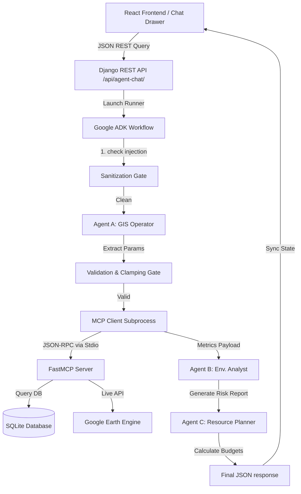

# GeoDrishti: Project Compendium & System Documentation

**Project Name:** GeoDrishti (Autonomous Multi-Agent Geospatial Assistant)  
**Institution:** NIT Silchar Research  
**Author:** Anubhav (2315094)  
**Core Objective:** Orchestrate an AI-first conversational dashboard leveraging multi-agent workflows, Model Context Protocol (MCP) server endpoints, and live satellite telemetry to automate the monitoring of riverine soil erosion and seasonal monsoon flooding.

---

## 1. Executive Summary & Problem Statement

### The Geographic Context
Majuli Island, located in Assam, India, is the world's largest river island. It is situated on the Brahmaputra River and faces extreme geomorphological changes due to rapid bankline erosion and severe seasonal monsoon flooding.

### The Technical overhead
Traditionally, assessing risk factors requires:
1. **Manual GIS Analysis:** Manually downloading and processing multispectral raster imagery from Sentinel/Landsat.
2. **Monsoon/Erosion Confounding:** Distinguishing seasonal monsoon flooding (temporary inundation) from permanent land loss due to bankline soil erosion.
3. **Planning Overheads:** Calculating mitigation requirements (bags, bamboo tons, budgets) manually using spreadsheet models.

### The GeoDrishti Solution
GeoDrishti provides a natural language conversational copilot overlaying an interactive map. When a user asks a question, three autonomous AI agents interact with database metrics and GEE satellite indices to run calculations, suggestions, and map alignments automatically.

---

## 2. Core Data & Remote Sensing Methodology

### Sentinel-2 NDWI composites
The historical database statistics (2018–2025) are not fabricated placeholders; they are derived from real Sentinel-2 satellite analysis:
* **Dry-Season Composites:** To isolate permanent soil erosion from temporary seasonal monsoon inundation, GEE filters and extracts imagery exclusively from the dry-season window (January–March).
* **Water Masking:** The Normalized Difference Water Index (NDWI) is computed using the Green and Near-Infrared (NIR) bands:
  $$\text{NDWI} = \frac{\text{Green} - \text{NIR}}{\text{Green} + \text{NIR}}$$
  A zero-threshold water mask is applied to calculate the exact water-surface area.

### Signed Water-Area Metrics
The Django database schema (`ErosionData`) tracks bankline movement using:
* `hectares` (float): The absolute hectares of land lost to erosion during the year.
* `water_area_ha` (float): The total computed surface water area.
* `raw_delta_ha` (float): The signed year-over-year change in water surface area. 
  - **Positive Delta:** Represents land lost to river water expansion (erosion).
  - **Negative Delta:** Captures sandbar/char emergence and vegetation growth (natural land accretion).

---

## 3. System Architecture & Component Breakdown

### A. The Three-Agent Pipeline (Google ADK)
The conversational core is driven by the Google Agentic Development Kit (ADK) and Gemini 1.5 Flash:
1. **Agent A (GIS Operator):**
   * **Role:** Parse natural language inputs into a structured Pydantic model (`GISParams`), identifying locations, date ranges, and indices (e.g. `flood_risk`, `erosion`).
   * **Robustness:** If it detects gibberish, off-topic prompts, or fails to find a location, it returns a clarification warning.
2. **Agent B (Environmental Analyst):**
   * **Role:** Review GEE satellite metrics and SQLite database stats to generate a comprehensive `RiskReport` (findings, narrative, and severity mapping).
   * **Rules:** Differentiates local historical statistics from global telemetry snapshots, sums cumulative land loss correctly, and binds its output to a Python-computed severity.
3. **Agent C (Resource Planner):**
   * **Role:** Formulate a structured `ResourcePlan` (geo-bags, budgets).
   * **Logic:** If the query references global coordinates (e.g. Tokyo), it bypasses calculations (plans are only applicable to Majuli). If local, it estimates structural costs.

### B. Tool-Calling Bridge (Model Context Protocol)
A `fastmcp` Python stdio server exposes backend tools to the ADK Agent workspace:
* `get_erosion_stats`: Queries the SQLite database for a target year or range.
* `get_gis_config`: Yields spatial coordinate bounds, landmarks, and indices descriptions.
* `get_gee_satellite_metrics`: Connects to GEE, filters clouds, calculates NDVI/NDWI median composites, and returns rounded telemetry metrics.
* `send_emergency_report`: Mock emergency dispatch email transaction.

---

## 4. Engineering Guardrails & Session State Security

### Input Sanitization Gate
Before queries reach Agent A, the `sanitize_input` node checks for prompt injection keywords (e.g. `"ignore instructions"`, `"system prompt"`). If flagged, it redirects to `security_failed_fallback` to halt execution.

### Query Clamping & Bounds Checks
* **Geographic Bounds:** Restricts queries to the Majuli region bounding box: Latitude `[26.70, 27.20]` and Longitude `[93.80, 94.70]`. Outside this, it defaults to Global Telemetry mode.
* **Temporal Capping:** Any query spanning more than 5 years is dynamically clamped to exactly 5 years from its start date to protect the backend from heavy sweeps.

### Session State Leak Protection
ADK session updates are merges. To prevent old analysis states (e.g. a previous query about Paris) from leaking into subsequent unrelated queries:
* **Explicit Nulling:** All early-exits, clarification paths, and validation failures explicitly return `None`/`null` for `risk_report`, `resource_plan`, `mcp_payload`, and `dispatch_confirmation` set to `None`, preventing data leakage between consecutive queries in a single session.
* **Happy Path Reset:** Successful analyses reset `dispatch_confirmation` to `None` to prevent old email receipts from lingering.

### Deterministic Severity Computation
To guarantee identical inputs produce identical severities (avoiding LLM non-determinism):
* **Fixed Python Thresholds:** Total hectares lost are run through a Python function `compute_severity`:
  - $\text{hectares\_lost} > 1000 \rightarrow$ `"HIGH"`
  - $\text{hectares\_lost} > 300 \rightarrow$ `"MEDIUM"`
  - $\text{hectares\_lost} \ge 0 \rightarrow$ `"LOW"`
* **Compliance:** The resulting string is passed into both the planner's context and the environmental analyst's prompt to force exact match compliance.

---

## 5. Frontend Visualizer Dashboard

* **Leaflet Map Integration:** Renders geographic polygons representing dry-season bankline borders (red) and monsoon flood inundation zones (blue).
* **Dynamic Visualization Loop:** Updates visual elements dynamically when the agent resolves coordinates (flies map to coordinates, places markers, and sets the timeline slider).
* **Local vs. Global Mode:** Shows historical temporal trend charts (Recharts) and mitigation panels for Majuli, but automatically switches to a real-time satellite metrics banner (NDVI, NDWI, Cloud cover, Scene date) for global coordinates.
* **Emergency toast alerts:** Triggers dynamic Toast notifications on successful report dispatches.

---

## 6. Production Cloud Architecture

* **Backend (Google Cloud Run):**
  - **Containerization:** Production multi-stage `Dockerfile` using `python:3.12-slim` to compile dependencies and copy the read-only SQLite database.
  - **Static Files:** Integrated `WhiteNoise` middleware and `STORAGES` configuration to serve Django REST assets in production without a separate Nginx container.
  - **Secret Manager Integration:** The `GEE_SERVICE_ACCOUNT_KEY` environment variable is loaded as a JSON string and parsed entirely in-memory using `from_service_account_info()`, eliminating the need to write GCP service account credentials to disk.
* **Frontend (Firebase Hosting):**
  - Built as a static SPA.
  - **Rewrite Proxy Routing:** Configured `firebase.json` to proxy `/api/**` calls directly to the Cloud Run backend, bypassing CORS and allowing frontend/backend to share a unified domain.
